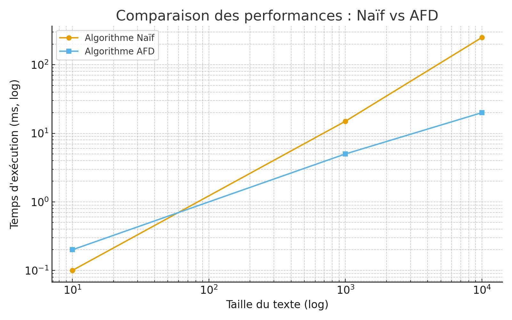

# Recherche de motifs (Pattern Matching)

## 📌 Objectif
Implémenter et comparer deux algorithmes de recherche de motifs dans un texte :
- **Algorithme naïf** (fenêtre glissante)
- **Automate à États Finis Déterministe (AFD)**

Le but est d’identifier toutes les occurrences d’un motif dans un texte et d’analyser les performances des deux approches.

## 🔧 Outils
- Langage **C**
- Compilation avec **GCC**
- Tests réalisés en **console** et avec des **fichiers externes**

## 📊 Méthodologie
1. **Conception et implémentation** :
   - Code modulaire (fichiers `.h` et `.c`)
   - Fonctions séparées pour la lecture, l’exécution et l’affichage des résultats

2. **Algorithmes testés** :
   - **Naïf** : Complexité `O(n*m)`
   - **AFD** : Construction en `O(m² * |Σ|)` puis recherche en `O(n)`

3. **Évaluation** :
   - Comparaison sur textes courts, moyens et longs
   - Mesures de performance (temps d’exécution)

## ✅ Résultats
- Sur des textes **courts** : performances similaires
- Sur des textes **longs** :
  - L’**algorithme naïf** devient lent
  - L’**AFD** est beaucoup plus efficace après sa construction
- Les résultats trouvés sont identiques (positions des motifs correctes)

### 📊 Comparaison visuelle

## 🚀 Perspectives
- Ajouter une interface graphique pour visualiser les occurrences
- Support de **plusieurs motifs simultanément** (ex. Aho-Corasick)
- Optimiser la construction de l’AFD
